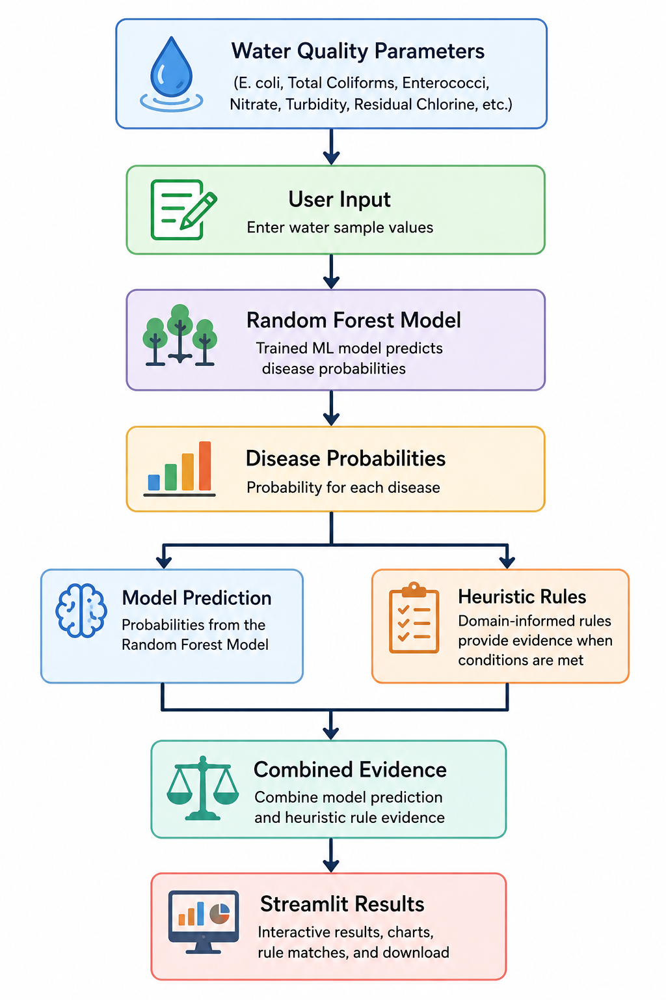

# Waterborne Disease Probability Predictor

A Machine Learning-powered web application that estimates the probability of waterborne diseases from water-quality parameters. The project combines a trained Random Forest classification model with heuristic, domain-informed rules and presents the results through an interactive Streamlit interface.

> **Collaborative Project:** Developed by **Shree Nath Mahato** and **Aditya Singh Baghel**

## Live Demo

[Waterborne Disease Probability Predictor - Streamlit App](https://waterborne-disease-probability-predictor.streamlit.app/)

## Repository

[GitHub Repository - Waterborne-Disease-Probability-Predictor](https://github.com/ShreeNathX/Waterborne-Disease-Probability-Predictor)

## Workflow



## Overview

Water quality plays an important role in the transmission and risk of waterborne diseases. This project explores how measurable water-quality parameters can be used with Machine Learning to estimate the probability of several waterborne diseases.

The application accepts water-quality measurements as input and produces disease-wise probability estimates. It also provides supporting information from heuristic rules to make the prediction process easier to interpret.

The project was developed collaboratively, with responsibilities divided between Machine Learning and application development, and research and domain analysis.

## Key Features

- Machine Learning-based probability prediction
- Random Forest classification model
- Disease-wise probability estimates
- Heuristic rules based on water-quality conditions
- Combination of model predictions and rule-based evidence
- Interactive Streamlit interface
- Feature-importance analysis
- Rule-match and empirical-confidence information
- Downloadable prediction results as CSV
- Pre-trained model for fast inference
- Lightweight local/deployable application

## Diseases Considered

The project includes probability estimation for:

- Cholera
- Diarrhea
- Typhoid
- Dysentery
- Hepatitis A

## Tech Stack

- **Python**
- **Pandas**
- **NumPy**
- **Scikit-learn**
- **Joblib**
- **Streamlit**
- **Jupyter Notebook**

## Machine Learning Workflow

The overall workflow consists of:

1. Collecting and preparing water-quality data.
2. Researching relationships between water-quality indicators and waterborne diseases.
3. Exploring and preprocessing the dataset.
4. Defining domain-informed heuristic rules.
5. Training a Random Forest classification model.
6. Evaluating the model and generating probability estimates.
7. Saving the trained model and supporting artifacts using Joblib.
8. Building a Streamlit application for interactive prediction.
9. Combining model predictions with supporting heuristic evidence.
10. Presenting prediction results, rule information, and feature importance to the user.

## Input Parameters

The model works with water-quality measurements available in the project dataset, including parameters such as:

- E. coli
- Total Coliforms
- Enterococci
- Nitrate
- Turbidity
- Residual Chlorine
- Other water-quality attributes included in the trained feature set

The exact input fields are loaded from the saved model artifacts, allowing the application to remain consistent with the trained model.

## Project Structure

```text
Waterborne-Disease-Probability-Predictor/
|
├── notebooks/
|   └── Model development and exploratory analysis notebooks
|
├── Workflow/
|   └── Workflow.png
|
├── app.py
├── train_and_save_model.py
├── model_artifacts.joblib
├── synthetic_water_quality_dataset.csv
├── test_samples.csv
├── requirements.txt
├── .gitignore
└── README.md
```

## Installation

### 1. Clone the repository

```bash
git clone https://github.com/ShreeNathX/Waterborne-Disease-Probability-Predictor.git
```

### 2. Navigate to the project directory

```bash
cd Waterborne-Disease-Probability-Predictor
```

### 3. Install dependencies

```bash
pip install -r requirements.txt
```

### 4. Run the application

```bash
streamlit run app.py
```

After starting the application, open the local URL displayed in the terminal, normally:

```text
http://localhost:8501
```

## Future Improvements

Potential future improvements include:

- Validation using real-world water-quality and outbreak datasets.
- Probability calibration and reliability analysis.
- Comparison of multiple Machine Learning models.
- Hyperparameter optimization.
- Batch prediction through CSV upload.
- Interactive water-quality analytics dashboard.
- Explainable AI using SHAP or LIME.
- More comprehensive disease-specific domain rules.
- Improved model evaluation using appropriate classification and probability metrics.
- Integration of additional water-quality datasets.

## Authors

<p>
  <strong>Shree Nath Mahato</strong><br>
  Data Preparation, Model Training, Validation, Heuristic Development, Prediction Interface<br>
  <a href="https://github.com/ShreeNathX">GitHub - ShreeNathX</a>
</p>

<p>
  <strong>Aditya Singh Baghel</strong><br>
  Model Architecture, Feature Selection, Rule-Based Logic, Prediction Analysis, Application Integration<br>
  <a href="https://github.com/ArBaghel">GitHub - ArBaghel</a>
</p>

---

**Waterborne Disease Probability Predictor**

*Machine Learning + Water Quality Research + Interactive Prediction*
